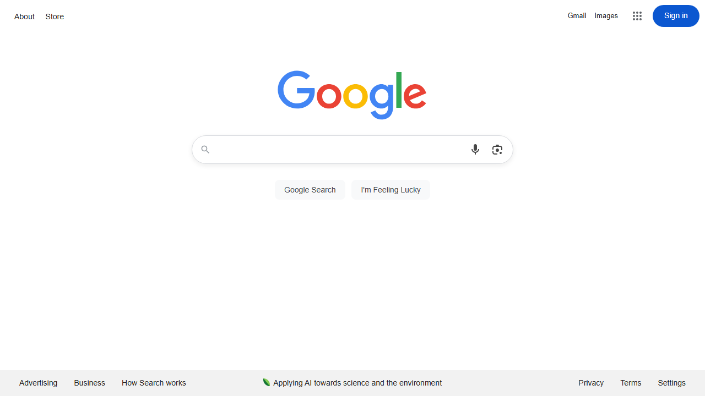

# Workflow Report

Total steps: 9

## Step 00 — Home page | Dialog open | Form valid
- URL: `https://www.google.com/`
- Action: `navigate(https://google.com)`
- **Modal/Dialog present**

## Step 01 — Home page | Dialog open | Form valid
- URL: `https://www.google.com/`
- Action: `wait`
- **Modal/Dialog present**

## Step 02 — Home page | Dialog open | Form valid
- URL: `https://www.google.com/`
- Action: `type(input[name='q']) [FAILED]`
- **Modal/Dialog present**

## Step 03 — Home page | Dialog open | Form valid
- URL: `https://www.google.com/`
- Action: `key_press`
- **Modal/Dialog present**

## Step 04 — Home page | Dialog open | Form valid
- URL: `https://www.google.com/`
- Action: `wait`
- **Modal/Dialog present**

## Step 05 — Home page | Dialog open | Form valid
- URL: `https://www.google.com/`
- Action: `click(link:Cake - Wikipedia) [FAILED]`
- **Modal/Dialog present**

## Step 06 — Home page | Dialog open | Form valid
- URL: `https://www.google.com/`
- Action: `wait`
- **Modal/Dialog present**

## Step 07 — Home page | Dialog open | Form valid
- URL: `https://www.google.com/`
- Action: `scroll`
- **Modal/Dialog present**

## Step 08 — Home page | Dialog open | Form valid
- URL: `https://www.google.com/`
- Action: `wait`
- **Modal/Dialog present**

