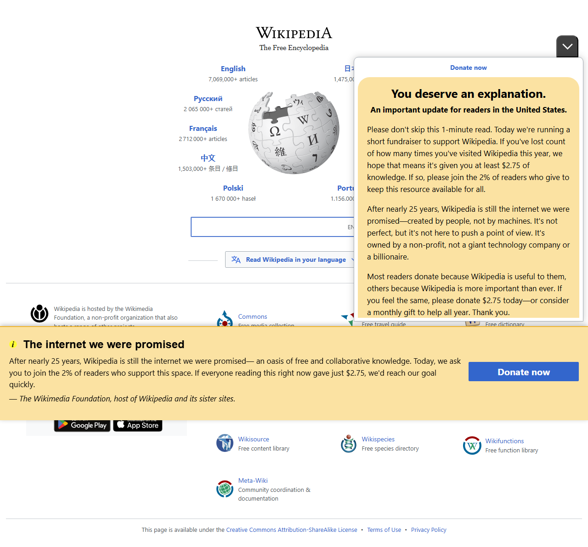
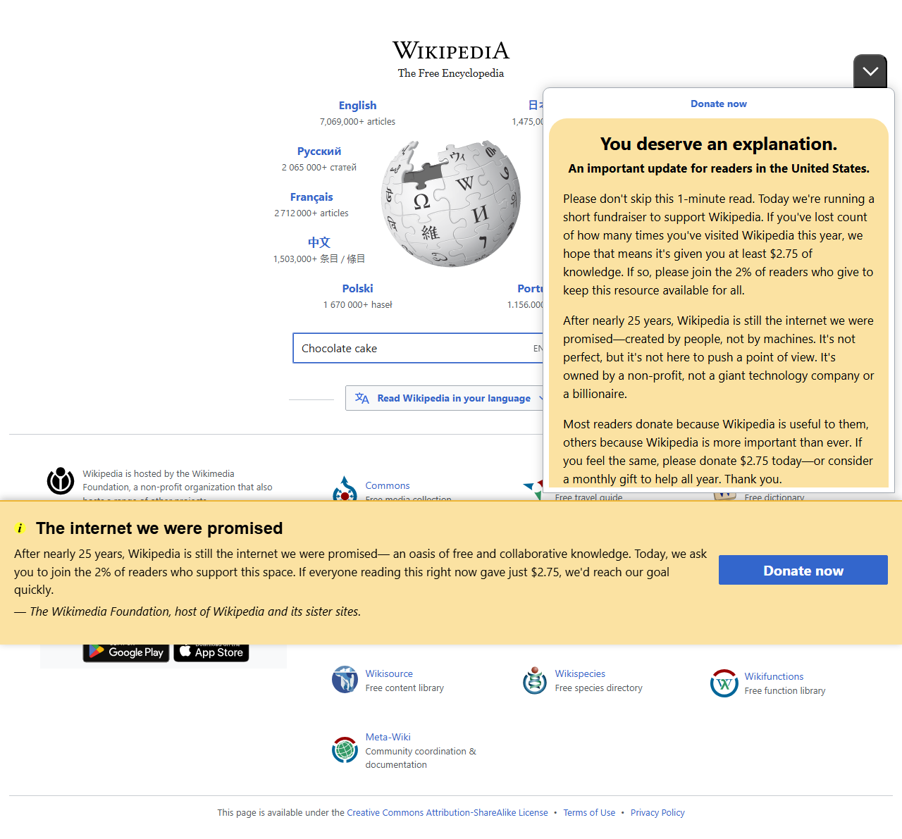
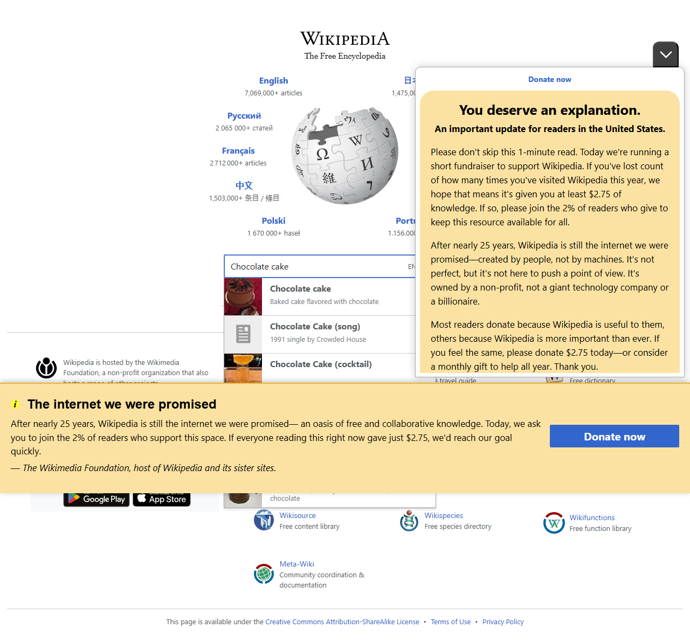
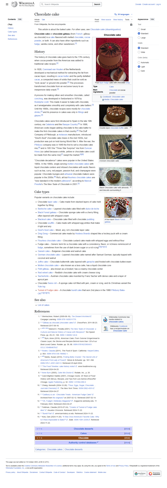

# Workflow Report

Total steps: 6

## Step 00 — Form valid
- URL: `https://www.wikipedia.org/`
- Action: `navigate(https://wikipedia.org)`

## Step 01 — Form valid
- URL: `https://www.wikipedia.org/`
- Action: `wait`

## Step 02 — Form valid
- URL: `https://www.wikipedia.org/`
- Action: `type(input[name='search'])`

## Step 03 — Form valid
- URL: `https://www.wikipedia.org/`
- Action: `submit(form#searchform button[type='submit']) [FAILED]`

## Step 04 — Form valid
- URL: `https://www.wikipedia.org/`
- Action: `wait`

## Step 05 — Form valid
- URL: `https://en.wikipedia.org/wiki/Chocolate_cake`
- Action: `click(link:Chocolate cake)`

