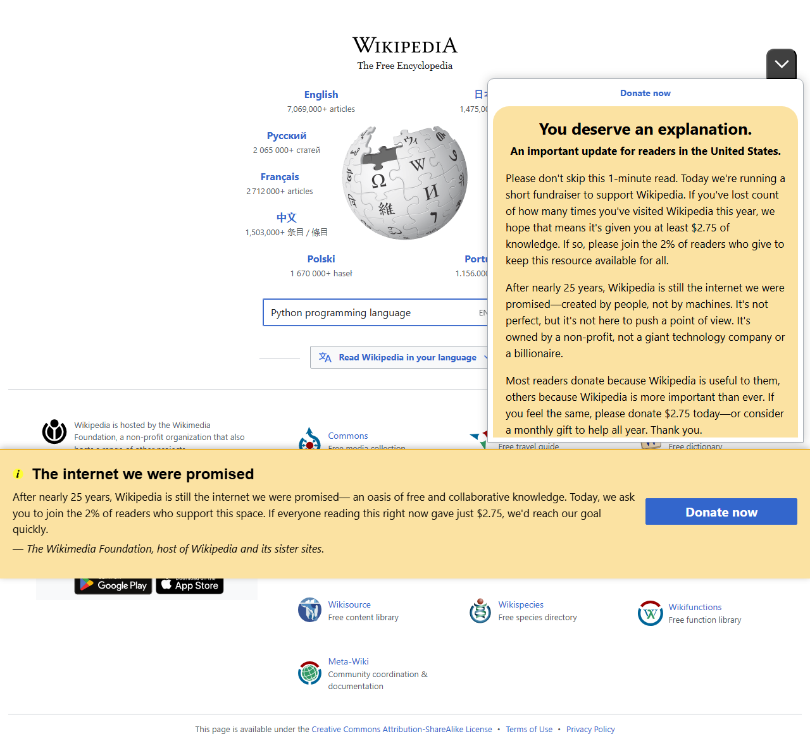

# Workflow Report

Total steps: 6

## Step 00 — Home page | Form valid
- URL: `https://www.wikipedia.org/`
- Action: `navigate(https://wikipedia.org)`

## Step 01 — Home page | Form valid
- URL: `https://www.wikipedia.org/`
- Action: `wait`

## Step 02 — Home page | Form valid
- URL: `https://www.wikipedia.org/`
- Action: `focus`

## Step 03 — Home page | Form valid
- URL: `https://www.wikipedia.org/`
- Action: `type(input[name='search'])`

## Step 04 — Wiki/python_(programming_language) page | Form valid | Structure changed (1.00)
- URL: `https://en.wikipedia.org/wiki/Python_(programming_language)`
- Action: `key_press`

## Step 05 — Wiki/python_(programming_language) page | Form valid
- URL: `https://en.wikipedia.org/wiki/Python_(programming_language)`
- Action: `wait`

